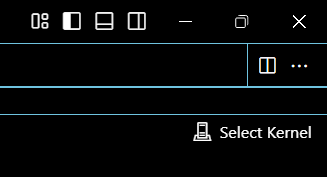
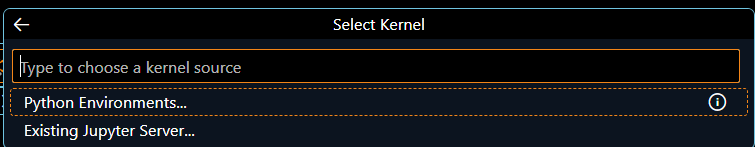
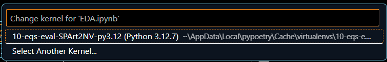

# 10 EQS Evaluation

```
.
├── EDA.ipynb
├── README.md
├── data
│   └── products.csv
├── img
│   └── image.png
├── poetry.lock
├── pyproject.toml
├── report.md
├── requirements.txt
└── src
    ├── __pycache__
    │   ├── analysis.cpython-312.pyc
    │   └── utils.cpython-312.pyc
    ├── analysis.py
    └── utils.py
```

---

## 📦 **Dependencies**

This project requires the following tools and libraries:

- **Python** (version 3.12)
- **Poetry** (version 1.8)
- **Virtual Environment** (venv)

---

## ⚙️ **Setting Up the Virtual Environment**

### 🔹 Using Poetry

1. **Install Dependencies:**

   ```bash
   poetry install
   ```

2. **Activate the Environment:**

   ```bash
   poetry shell
   ```

---

### 🔹 Using Virtual Environment (venv)

1. **Create the Virtual Environment:**

   ```bash
   python3 -m venv venv
   ```

2. **Activate the Virtual Environment:**

   - On **Windows**:

     ```bash
     venv\Scripts\activate
     ```

   - On **macOS/Linux**:

     ```bash
     source venv/bin/activate
     ```

3. **Install Dependencies:**

   ```bash
   pip install -r requirements.txt
   ```

---

## 🐍 **Selecting the Python Kernel in VSCode**

1. Open the Command Palette in VSCode (**`Ctrl + Shift + P`** or **`Cmd + Shift + P`** on macOS).
2. Search for and select **"Python: Select Interpreter"**.
3. Choose the environment you created.

### 📸 **Visual Guide**

1. **Selecting the Python Kernel:**

   

2. **Selecting Python Environments:**

   

3. **Choosing the Poetry Environment:**

   

---

## 📄 **Reports and Analysis**

- **Exploratory Data Analysis:** `EDA.ipynb`
- **Final Report:** `report.md`
- **KPI Visualization:** `img/image.png`

---

## 🚀 **Project Structure**

- **`data/`**: Contains the dataset (`products.csv`).
- **`src/`**: Contains the source code (`analysis.py` and `utils.py`).
- **`img/`**: Stores images used in documentation and reports.
- **`EDA.ipynb`**: Jupyter notebook for exploratory data analysis.
- **`report.md`**: Markdown report summarizing the analysis and findings.

---

## 👨‍💻 **Author**

Developed by Sebastian Ortiz (sebas1193)
