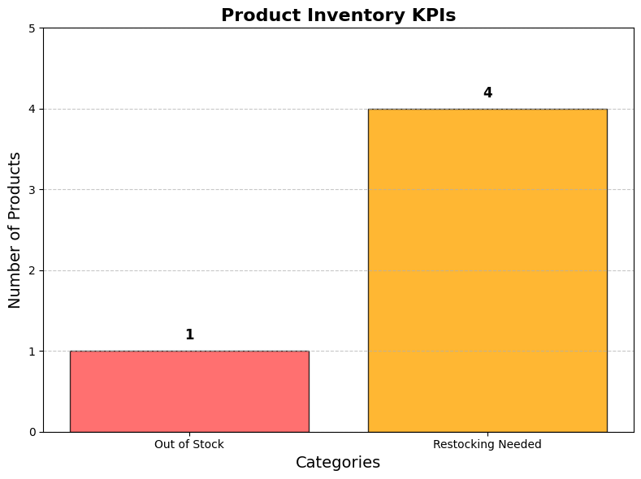

# REPORT
---

#### 1. **Loading and Initial Cleaning of the CSV File**
   - **Issue Detected:** The CSV file had errors due to a missing comma, truncated parts of the text, and improperly formatted quotes.
   - **Solution Applied:** Added an extra comma in the CSV columns to correct the conflict and facilitate proper reading.

#### 2. **Inspecting the DataFrame**
   - Data types were reviewed, and an additional unnamed column was detected due to the faulty CSV format.
   - **Action Taken:** The last incomplete column was removed to ensure data quality.

#### 3. **Correcting Values in Columns**
   - **Issue Detected:** The `current_stock` column contained string values instead of integers.
   - **Solution Applied:** Replaced non-numeric values in `current_stock` with zeros (`0`).

   - **Issue Detected:** The `our_price` column contained the `$` symbol, preventing values from being treated as numbers.
   - **Solution Applied:** Removed the `$` symbol and converted the column to `float`.

#### 4. **Data Type Conversion**
   - The `current_stock` column was converted to `int` to ensure proper handling as a numeric value.

#### 5. **Extracting and Enriching Data**
   - **Action Taken:** Extracted information from the parentheses in the `product_name` column and created two new columns to enrich the DataFrame with additional product details (e.g., unit of measure).

#### 6. **Renaming Columns**
   - An unnamed column was detected and assigned an appropriate name to facilitate identification and use.

#### 7. **Date Formatting**
   - Standardized the date format in the corresponding column to ensure uniformity.

#### 8. **String Standardization**
   - Normalized text values in columns like `category` to avoid inconsistencies (e.g., `Beverages` and `beverages`).

#### 9. **Imputation of Missing Data**
   - **Action Taken:** Identified missing values in the `restock_threshold` column for products in the `Tea` category. These values were imputed using the average restock threshold for that category.

---

### **Identified KPIs**

1. **Out-of-Stock Products:**
   - Identified **1 product** that was out of stock: `Mint Tea`.

2. **Products Needing Restocking:**
   - Found **4 products** that need restocking:
     - `Yerbamate Loose Leaf`
     - `Chamomile Tea`
     - `Matcha Green Tea Powder`
     - `Mint Tea`

3. **Total Inventory Value:**
   - The total inventory value is **$3065.46**.

---

### **Recommendations Based on the KPIs**

1. **Priority Restocking:**
   - Prioritize restocking the identified products to avoid losses due to stockouts.

2. **Continuous Monitoring:**
   - Implement an automated system to monitor `current_stock` levels and send alerts when inventory is close to the restock threshold.

3. **Inventory Optimization:**
   - Evaluate sales patterns for `Tea` products and adjust `restock_threshold` levels to avoid both stockouts and overstocking.

4. **CSV File Quality:**
   - Request that CSV files be delivered in a clean and structured format to avoid issues with reading and processing in the future.

5. **Regular Analysis:**
   - Conduct exploratory data analysis periodically to detect trends and optimize inventory management.

---